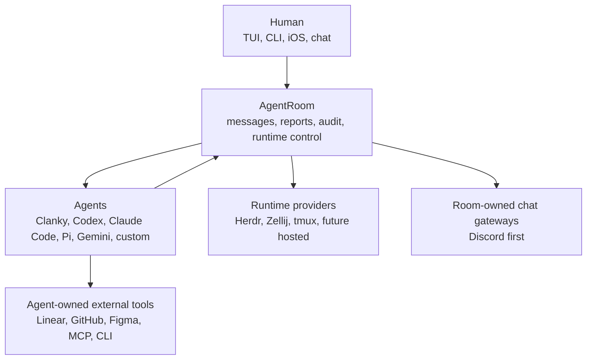

# AgentRoom

AgentRoom is the local-first control room for long-running coding agents. Open
the terminal dashboard, ask what is happening, launch or redirect agents, and
keep the active work in one evented room instead of scattered across terminal
panes, chat threads, and issue comments.

The important idea is simple: the room is the product. Runtime providers and
room-owned chat gateways are AgentRoom adapters; trackers, design tools, code
hosts, MCP servers, and phone clients are surfaces that agents or humans use
around that room.

## When To Use AgentRoom

Use AgentRoom when one of these is true:

- more than one agent needs to coordinate
- you want a simple terminal dashboard instead of watching raw panes
- you need audited `send`, `read`, `launch`, and `stop` for runtime agents
- work should stay tied to durable tracker issues while execution happens in one room
- an agent should wait for room messages, peer agent state, or human approval
- you want to check the room from a phone over a private network

Use Clanky directly when you want a personal Pi agent with profile state,
memory, communication gateways, voice/media adapters, and skills. Discord is
the current concrete gateway, not the boundary of the model. Run Clanky inside
AgentRoom when that personal agent needs to act as a lead, worker, reviewer, or
room participant.

## 1. What You Can Do

AgentRoom is the control layer in the agent-first workspace:

- open the singleton TUI from anywhere and ask what is happening in plain
  language
- launch agents into Herdr, Zellij, tmux, or any future runtime provider
- send and read through audited room commands instead of raw terminal input
- let compatible agents inspect room context and coordinate through MCP
- connect a phone over a private tailnet for on-the-go room checks
- route external chat into the room without making chat the source of truth
- keep durable work trackers canonical while AgentRoom records execution state

<!-- Capture backlog:
- docs/assets/gifs/agentroom-tui-overview.gif: TUI moving between operator chat, overview, agents, messages, runtime output, and events.
- docs/assets/gifs/agentroom-launch-provider.gif: provider-backed launch, send, read, and handoff in the same room.
-->

## 2. What To Let Agents Handle

Let agents use AgentRoom for active execution:

- identify the configured work tracker before editing
- post short status updates and handoffs
- ask reviewers or humans through room DMs
- wait for DMs, peer agent state, or review signals
- launch helper workers when the configured runtime supports it
- update the external tracker when durable status changes
- summarize terminal output instead of forcing the human to read every pane

AgentRoom is the room. Terminals and room-owned chat are surfaces into it;
trackers, code hosts, and design tools are external tools that agents use and
link back to room state.

## 3. Mental Model



For the full product tour, see [Ecosystem Tour](docs/ECOSYSTEM.md).

## First Run

Start with the dashboard. You do not need to memorize the CLI before using the
room.

```bash
corepack enable
corepack prepare pnpm@11 --activate
pnpm install
pnpm build
export PATH="$PWD/node_modules/.bin:$PATH" # source checkout only
agent-room
```

The TUI starts in operator chat. Ask it things like:

```text
What is running in this room?
Launch a reviewer for this workspace.
Read the latest output from impl-1.
Post a status update for the room.
```

Use the CLI when you need automation, scripts, or exact commands. See
[CLI Reference](docs/CLI_REFERENCE.md) for the complete command map.

The released CLI is intended to behave like any other command: run
`agent-room` and the TUI opens. The `PATH` line is only for a source checkout
before the CLI is installed globally.

## What Is In This Repo

```text
apps/
  cli/             agent-room CLI
  daemon/          local HTTP API daemon
  mcp-server/      stdio MCP server for room context and coordination
  tui/             interactive terminal dashboard and operator chat
  mobile/          Expo/React Native client for daemon API access
packages/
  core/            rooms, agents, messages, reports, events, ports
  config/          typed AgentRoom home config parser and writer
  storage-jsonl/   append-only event store for local rooms
  runtime-herdr/   Herdr runtime adapter
  runtime-zellij/  Zellij runtime adapter
  runtime-tmux/    tmux runtime adapter
  runtime-fake/    contract-test runtime
  integrations/    room-owned chat gateway adapters
skills/
  agentroom/       enrolled worker/reviewer behavior
  agentroom-operator/
                   lead/operator behavior for launching and steering agents
docs/
  product tour, setup, topology, runtime, skills/protocols, security, ADRs
```

## Build And Test

```bash
corepack enable
corepack prepare pnpm@11 --activate
pnpm install
pnpm build
pnpm test
```

Start the local singleton room:

```bash
agent-room runtime doctor
agent-room daemon start
agent-room
herdr --session agent-room
# or:
zellij attach agent-room
```

Launch a real agent through the selected runtime:

```bash
agent-room launch impl \
  --harness HARNESS_KIND \
  --command "AGENT_COMMAND" \
  --cwd /path/to/workspace

agent-room send impl "Use AgentRoom, check the configured tracker, and post status before editing."
agent-room read impl --lines 40
```

AgentRoom state lives in the nearest `.agentroom/` directory; set
`AGENTROOM_HOME` only when you want an explicit singleton home. The room id and
Herdr session default to `agent-room`; cwd is workspace context, not room
identity. `.agentroom/config.yaml` is topology, and `.agentroom/AGENTS.md` is
the editable room protocol. `launch`, `send`, `read`, and `stop` require an
AgentRoom binding by default so terminal input and output stay in the room event
log.

## TUI, MCP, And Mobile

Open the terminal dashboard:

```bash
agent-room
```

The TUI starts in operator chat. Type normally to ask what is happening or to
request room actions. Use `/help`, `/runtime`, `/trace`, and `/effort` for
operator controls; use `Esc` or `Ctrl+G` / `Ctrl+L` to move across chat,
overview, workspaces, agents, messages, events, logs, settings, and help.

Expose room tools to agents through the MCP server:

```bash
agentroom-mcp
```

The MCP surface includes identity/context, post/DM/messages, directed-message
reads, filtered waits, agent presence, audit events, the user-visible feed,
reports, and iOS diagnostics.

Pair mobile over a private tailnet:

```bash
agent-room daemon start --tailnet
agent-room mobile-connect --copy
```

Open the copied `agentroom://connect?...` link on the phone. The daemon URL and
token are saved by the mobile client, and `/v1/*` routes require the bearer
token when tailnet mode or `AGENTROOM_API_TOKEN` is active.

After the iOS app has registered a device token, the daemon can send the current
connection settings over APNs:

```bash
export AGENTROOM_APNS_KEY_PATH=/path/to/AuthKey_XXXXXXXXXX.p8
export AGENTROOM_APNS_KEY_ID=XXXXXXXXXX
export AGENTROOM_APNS_TEAM_ID=TEAMID1234
agent-room mobile-connect --push
```

Use `AGENTROOM_APNS_BUNDLE_ID` and `AGENTROOM_APNS_ENV=production` when the app
bundle id or APNs host differs from the default development build.

<!-- Capture backlog:
- docs/assets/gifs/mobile-room-check.gif: daemon pairing, phone connection, and a quick room status check.
-->

## Provider Model

AgentRoom core owns local room behavior. Provider ports keep the rest
replaceable:

- `RuntimeProvider`: Herdr, Zellij, tmux, fake today; Docker, SSH, ECS,
  Kubernetes, or custom adapters later.
- Work tracker config: provider-neutral selection plus room protocol. Agents
  use the selected tracker's MCP server, connector, CLI, or skill and link
  external refs back to room messages, reports, or tracker events.
- `ChatGatewayProvider`: communication gateway routing primitives. Discord is
  the first adapter; other chat surfaces should follow the same owner/routing
  model.

Code hosts, design tools, one-off notifications, and durable tracker mutations
are agent-owned tool usage, not AgentRoom adapter ports. Agents use the MCP
servers, connectors, CLIs, skills, or auth stores available in their runtime and
bring the result back to the room through messages, refs, reports, and status.

The external work tracker remains canonical for issues, ownership, workflow
status, acceptance criteria, and durable comments. AgentRoom keeps execution
messages, handoffs, human questions, runtime audit, agent-state signals,
tracker events, reports, and active coordination.

## Clanky And Other Agents

AgentRoom launches Clanky as a normal Pi harness command, the same way it can
launch Codex, Claude Code, Gemini CLI, shell, or a custom command:

```bash
agent-room launch clanky --harness pi --command clanky --cwd /path/to/workspace
```

Room participation and gateway ownership are separate. Clanky may keep its own
agent-owned communication identity while participating in a room, or AgentRoom
may own a room connector and route chat to a lead agent. One external
conversation should have exactly one owner.

For the Clanky-side contract, see
[../clanky-pi/docs/AGENTROOM.md](../clanky-pi/docs/AGENTROOM.md).

## Documentation

Run the docs UI:

```bash
pnpm docs:dev
```

High-signal pages:

- [Ecosystem Tour](docs/ECOSYSTEM.md)
- [Terminal TUI](docs/TUI.md)
- [Setup Guide](docs/SETUP.md)
- [Skills And Protocols](docs/SKILLS_AND_PROTOCOLS.md)
- [AgentRoom Protocol](docs/PROTOCOL.md)
- [CLI Reference](docs/CLI_REFERENCE.md)
- [Configuration Model](docs/CONFIGURATION.md)
- [Room Topology](docs/TOPOLOGY.md)
- [Coordination Model](docs/COORDINATION.md)
- [Runtime Providers](docs/RUNTIMES.md)
- [Security Model](docs/SECURITY.md)
- [Architecture](docs/ARCHITECTURE.md)
- [System Diagram](docs/DIAGRAM.md)
- [Roadmap](docs/ROADMAP.md)

## Design Goals

1. AgentRoom is the room, not a wrapper around one terminal multiplexer.
2. Every agent opt-in is explicit.
3. Runtime input/output is privileged and auditable.
4. Agents coordinate through room commands, channel messages, DMs, waits,
   reports, and agent-state signals.
5. External trackers, design tools, and code hosts stay agent-owned; room-owned
   chat gateways are explicit adapters with one owner per conversation.
6. The local MVP should work on one machine, but the ports should survive
   hosted and multi-host runtimes.

## Current Maturity

AgentRoom is a runnable local coordination plane. It includes the core room
model, CLI, daemon HTTP API, TUI, MCP server, Expo mobile client, JSONL event
storage, Herdr/Zellij/tmux/fake runtime providers, audited runtime launch/read/send/
stop, Herdr and Zellij pane adoption, wait/events-follow, tracker refs/events,
user-visible reports/feed, chat gateway routing primitives with a Discord
adapter today, and mobile tailnet pairing.

Next useful work: SQLite event storage, stronger real-runtime contract tests,
operator CLI support for chat route mutation, more ergonomic tracker protocol,
and hosted or multi-host runtime adapters.
