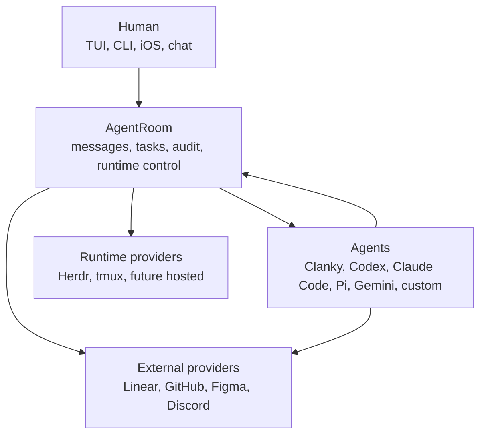

# AgentRoom

AgentRoom is the local-first coordination plane for long-running coding agents.
It gives humans and agents one room model for launch, messages, task shadows,
handoffs, approvals, runtime audit, and provider integrations.

The important idea is simple: runtimes, trackers, design tools, code hosts, and
chat systems are adapters. The room stays the product.

## 1. What You Can Do

AgentRoom is the control layer in the agent-first workspace:

- open the TUI and ask the operator what is happening
- launch agents into Herdr, tmux, or any future runtime provider
- send and read through audited room commands instead of raw terminal input
- expose room context through MCP to enrolled agents
- connect a phone over a private tailnet for on-the-go room checks
- route external chat into the room without making chat the source of truth
- keep durable work trackers canonical while AgentRoom records execution state

> GIF slot: `docs/assets/gifs/agentroom-tui-overview.gif`  
> Capture the TUI moving between operator chat, overview, agents, tasks,
> messages, runtime output, and events.

> GIF slot: `docs/assets/gifs/agentroom-launch-provider.gif`  
> Capture a provider-backed launch, then `send`, `read`, and task handoff in the
> same room.

## 2. What To Let Agents Handle

Let agents use AgentRoom for active execution:

- claim local task shadows before editing
- post short status updates and handoffs
- ask reviewers or humans through room DMs
- wait for DMs, task changes, or review signals
- launch helper workers when the configured runtime supports it
- update the external tracker when durable status changes
- summarize terminal output instead of forcing the human to read every pane

AgentRoom is the room. Terminals, chat systems, trackers, and design tools are
surfaces or providers.

## 3. Mental Model



For the full product tour, see [Ecosystem Tour](docs/ECOSYSTEM.md).

## What Is In This Repo

```text
apps/
  cli/             agent-room CLI
  daemon/          local HTTP API daemon
  mcp-server/      stdio MCP server for room context and coordination
  tui/             interactive terminal dashboard and operator chat
  mobile/          Expo/React Native client for daemon API access
packages/
  core/            rooms, agents, messages, tasks, events, ports
  config/          typed .agentroom/config.yaml parser and writer
  storage-jsonl/   append-only event store for local rooms
  runtime-herdr/   Herdr runtime adapter
  runtime-tmux/    tmux runtime adapter
  runtime-fake/    contract-test runtime
  integrations/    tracker, chat, design, code-host, notification adapters
skills/
  agentroom/       enrolled worker/reviewer behavior
  agentroom-operator/
                   lead/operator behavior for launching and steering agents
docs/
  product tour, setup, topology, runtime, security, protocol, ADRs
```

## Quick Start

```bash
corepack enable
corepack prepare pnpm@11 --activate
pnpm install
pnpm build
pnpm test
```

Create a room with an explicit runtime:

```bash
agent-room init --room my-project --runtime herdr
agent-room runtime doctor
agent-room daemon start
agent-room tui
```

Launch a real agent through the selected runtime:

```bash
agent-room launch impl \
  --harness HARNESS_KIND \
  --command "AGENT_COMMAND" \
  --cwd .

agent-room send impl "Use AgentRoom, claim your task, and post status before editing."
agent-room read impl --lines 40
```

`launch`, `send`, `read`, and `stop` require an AgentRoom binding by default so
terminal input and output stay in the room event log. Use raw provider commands
only for manual recovery.

## TUI, MCP, And Mobile

Open the terminal dashboard:

```bash
agent-room tui
```

The TUI starts in operator chat. Type normally to ask what is happening or to
request room actions. Use `/help`, `/runtime`, `/trace`, and `/effort` for
operator controls; use `Esc` or `Ctrl+G` / `Ctrl+L` to move across chat,
overview, agents, tasks, messages, and events.

Expose room tools to agents through the MCP server:

```bash
agentroom-mcp
```

Pair mobile over a private tailnet:

```bash
agent-room daemon start --tailnet
agent-room mobile-connect --copy
```

Open the copied `agentroom://connect?...` link on the phone. The daemon URL and
token are saved by the mobile client, and `/v1/*` routes require the bearer
token when tailnet mode or `AGENTROOM_API_TOKEN` is active.

> GIF slot: `docs/assets/gifs/mobile-room-check.gif`  
> Capture daemon pairing, phone connection, and a quick room status check.

## Provider Model

AgentRoom core owns local room behavior. Provider ports keep the rest
replaceable:

- `RuntimeProvider`: Herdr, tmux, fake today; Docker, SSH, ECS, Kubernetes, or
  custom adapters later.
- `WorkTrackerProvider`: Linear bridge today; GitHub/Jira/custom trackers can
  stay external until bridged.
- `ChatGatewayProvider`: Discord routing primitives today; other chat surfaces
  should follow the same owner/routing model.
- `CodeHostProvider`, `DesignProvider`, and `NotificationProvider`: optional
  integrations that should not leak provider-specific assumptions into the room
  model.

The external work tracker remains canonical for issues, ownership, workflow
status, acceptance criteria, and durable comments. AgentRoom keeps execution
messages, local task shadows, handoffs, human questions, runtime audit, and
active coordination.

## Clanky And Other Agents

AgentRoom launches Clanky as a normal Pi harness command, the same way it can
launch Codex, Claude Code, Gemini CLI, shell, or a custom command:

```bash
agent-room launch clanky --harness pi --command clanky --cwd .
```

Room participation and chat ownership are separate. Clanky may keep its own
agent-owned Discord identity while participating in a room, or AgentRoom may own
a room connector and route chat to a lead agent. One external conversation
should have exactly one owner.

For the Clanky-side contract, see
[../clanky-pi/docs/AGENTROOM.md](../clanky-pi/docs/AGENTROOM.md).

## Documentation

Run the docs UI:

```bash
pnpm docs:dev
```

High-signal pages:

- [Ecosystem Tour](docs/ECOSYSTEM.md)
- [Setup Guide](docs/SETUP.md)
- [Configuration Model](docs/CONFIGURATION.md)
- [Room Topology](docs/TOPOLOGY.md)
- [Coordination Model](docs/COORDINATION.md)
- [Runtime Providers](docs/RUNTIMES.md)
- [Security Model](docs/SECURITY.md)
- [Architecture](docs/ARCHITECTURE.md)
- [System Diagram](docs/DIAGRAM.md)
- [Roadmap](docs/ROADMAP.md)

## Design Goals

1. AgentRoom is the room, not a wrapper around one terminal multiplexer.
2. Every agent opt-in is explicit.
3. Runtime input/output is privileged and auditable.
4. Agents coordinate through room commands, channel messages, DMs, and task
   shadows.
5. External trackers, design tools, code hosts, and chat systems stay provider
   adapters.
6. The local MVP should work on one machine, but the ports should survive
   hosted and multi-host runtimes.

## Current Maturity

AgentRoom is a runnable local coordination plane. It includes the core room
model, CLI, daemon HTTP API, TUI, MCP server, Expo mobile client, JSONL event
storage, tmux/Herdr/fake runtime providers, audited runtime launch/read/send/
stop, Herdr pane adoption, wait/events-follow, local task shadows, Linear bridge
commands, Discord gateway routing primitives, and mobile tailnet pairing.

Next useful work: SQLite event storage, stronger runtime contract tests,
operator CLI support for chat route mutation, more ergonomic tracker bridges,
and hosted or multi-host runtime adapters.
