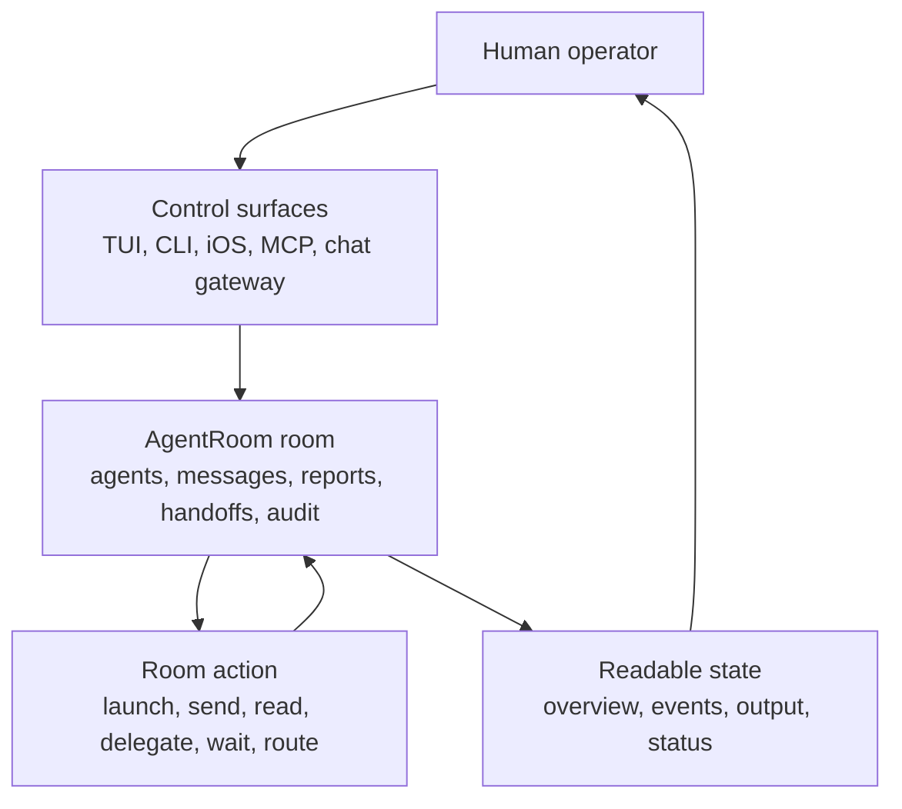
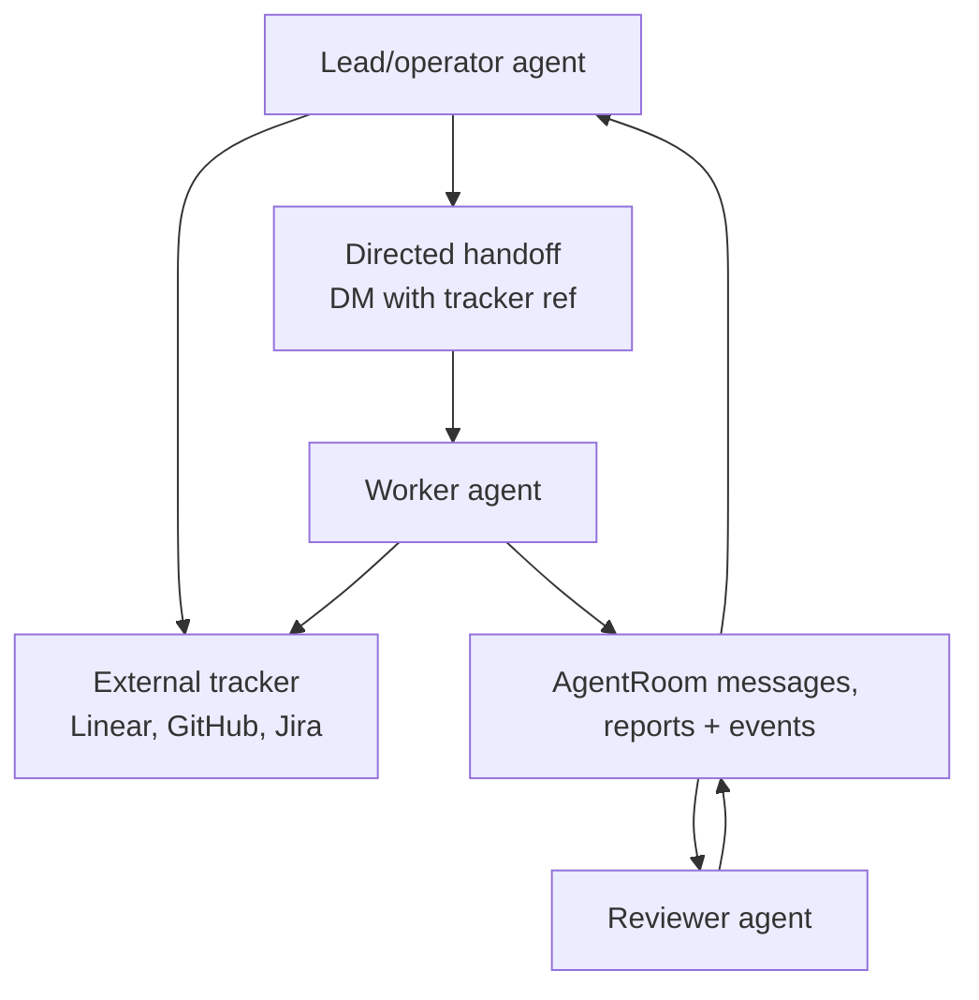
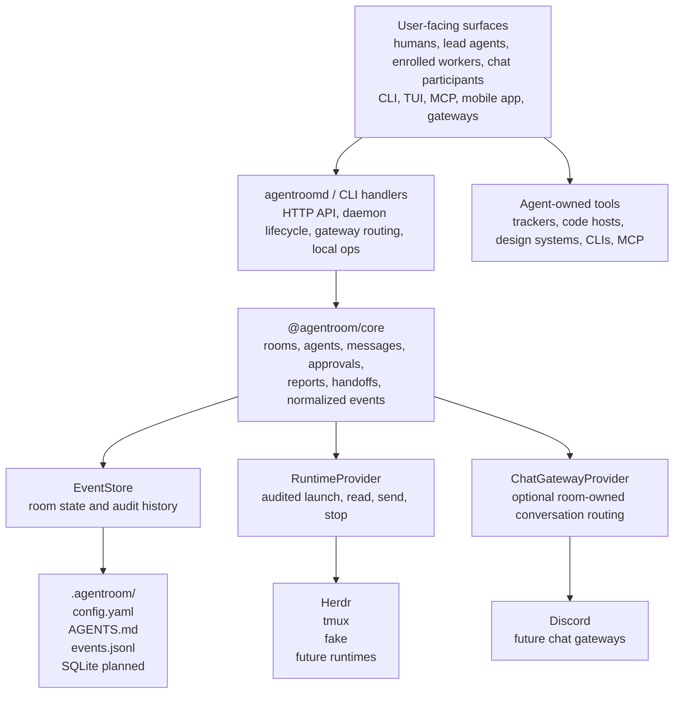

# AgentRoom Diagrams

These diagrams are the mental model for AgentRoom. Read them from the user's
point of view first, then from the agent's point of view.

## User Control Loop

The operator should not need to remember which terminal pane matters. The room
collects runtime state, coordination messages, reports, agent state, and recent
audit events into one control surface.

## Agent Delegation Loop

Agents should use AgentRoom for active coordination and the selected tracker for
durable work records. If a room message becomes important outside the active
execution context, summarize it into the tracker.

## System Boundaries

## Read The Boundaries

- `.agentroom/config.yaml` owns durable room topology: runtime providers,
  room-owned gateways and routes, dashboard operator defaults, work tracker
  selection, and storage settings. `AGENTROOM_HOME` can explicitly point to a
  singleton room home when discovery is not desired.
- `.agentroom/AGENTS.md` owns editable room protocol for dashboard-agent and
  worker behavior.
- The event log owns room state and audit history: messages, reports, imported
  tracker events, runtime bindings, chat ingress/egress, and terminal
  input/output observations.
- Runtime providers own process placement and terminal control. AgentRoom uses
  provider capabilities instead of assuming Herdr, tmux, Docker, SSH, or a
  hosted scheduler.
- Durable external systems stay external. The selected work tracker remains
  canonical for issues and workflow; agents use their own MCP servers,
  connectors, CLIs, and skills for tracker/code/design work while AgentRoom
  keeps local execution context and refs.

## Primary Flow

1. A human, lead agent, MCP-capable agent, mobile client, or chat gateway sends
   a room action.
2. `agentroomd` or the CLI loads AgentRoom config, validates the
   request, and calls `@agentroom/core`.
3. Core appends normalized events to the `EventStore` and updates rebuildable
   views.
4. Runtime actions go through `RuntimeProvider` adapters so `launch`, `read`,
   `send`, and `stop` stay audited.
5. Room-owned chat reaches external conversations through `ChatGatewayProvider`.
   Trackers, code hosts, design systems, and one-off notifications are handled
   by the agents that need them, then summarized back into the room.

For the written model, see [Architecture](ARCHITECTURE.md),
[Configuration](CONFIGURATION.md), [Coordination](COORDINATION.md), and
[Runtime Providers](RUNTIMES.md).
