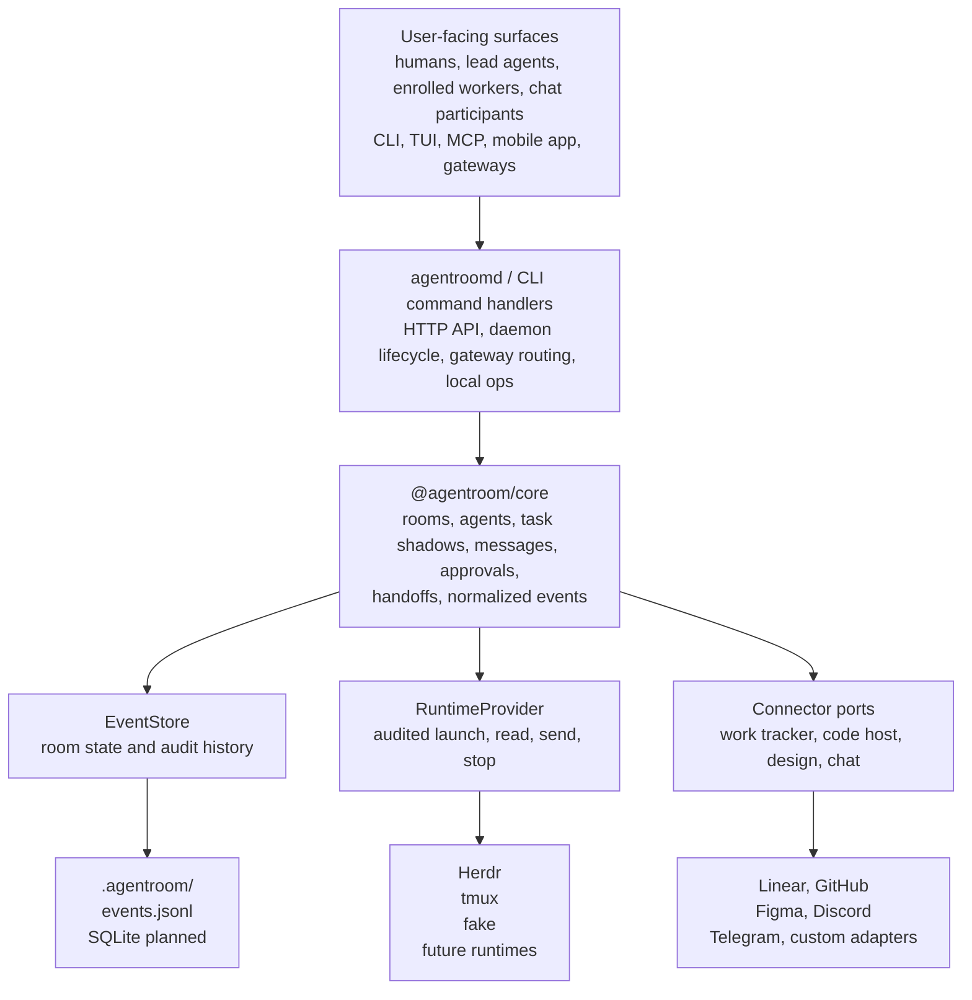

# AgentRoom Diagram

This is the docs-UI-friendly map of the AgentRoom system boundaries.

## Read The Boundaries

- `.agentroom/config.yaml` owns durable room topology: runtime providers, room-owned gateways and routes, dashboard operator defaults, and storage settings.
- The event log owns room state and audit history: messages, local task shadows, runtime bindings, chat ingress/egress, and terminal input/output observations.
- Runtime providers own process placement and terminal control. AgentRoom uses provider capabilities instead of assuming Herdr, tmux, Docker, SSH, or a hosted scheduler.
- Connector ports keep durable external systems external. The work tracker remains canonical for issues and workflow; AgentRoom keeps local execution context and refs.

## Primary Flow

1. A human, lead agent, MCP-capable agent, mobile client, or chat gateway sends a room action.
2. `agentroomd` or the CLI loads `.agentroom/config.yaml`, validates the request, and calls `@agentroom/core`.
3. Core appends normalized events to the `EventStore` and updates rebuildable views.
4. Runtime actions go through `RuntimeProvider` adapters so `launch`, `read`, `send`, and `stop` stay audited.
5. External tracker, code host, design, notification, and chat systems are reached through connector ports when the room explicitly configures them.

For the written model, see [Architecture](docs/ARCHITECTURE.md), [Configuration](docs/CONFIGURATION.md), [Coordination](docs/COORDINATION.md), and [Runtime Providers](docs/RUNTIMES.md).
