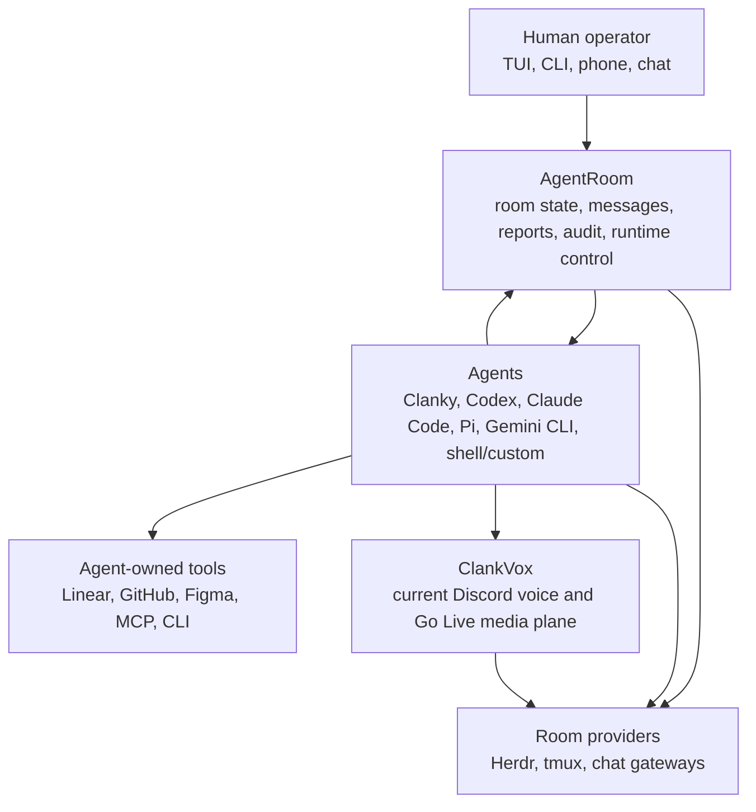
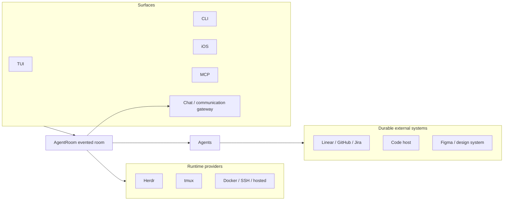
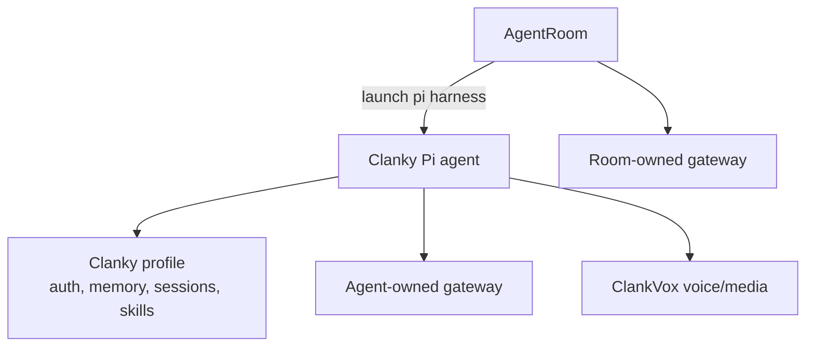

# Ecosystem Tour

These docs answer three questions quickly:

1. What powerful things can I do as a user?
2. What work should I let my agents handle?
3. What mental model explains what is happening under the hood?

AgentRoom is the room and control plane. Clanky is the personal Pi agent that
can live inside or outside a room and speak through communication gateways.
Discord is the current concrete text/voice adapter, not the boundary of the
model. ClankVox is the native media plane underneath today's Discord voice and
Go Live path. The iOS client makes the room reachable when the operator is away
from the desk.

## Which Surface Should I Use?

| Need                                                | Start here                                                     |
| --------------------------------------------------- | -------------------------------------------------------------- |
| I want to know what all the agents are doing.       | Open `agent-room` and ask the operator chat.                   |
| I want one personal agent with memory and communication gateways. | Start Clanky directly.                             |
| I want Clanky plus other agents in one shared room. | Launch Clanky from AgentRoom as a Pi harness.                  |
| I want to script room actions.                      | Use the AgentRoom CLI reference.                               |
| I want to check the room from my phone.             | Pair AgentRoom iOS over a private tailnet.                     |
| I want voice or Go Live through today's Discord adapter. | Use Clanky voice; ClankVox handles the native media transport. |

## 1. What You Can Do

Use AgentRoom as an agent command center:

- open the TUI and ask the operator what is happening in plain language
- see active agents, messages, runtime output, and recent audit events
- launch workers into Herdr or tmux without leaving the room model
- send instructions and read output through audited AgentRoom commands
- keep durable tracker issues canonical while room coordination stays local
- let compatible agents inspect and update room context through their tools
- route Discord or another communication surface into a room-owned conversation
- pair a phone over tailnet and check the room on the go
- run Clanky as a personal agent, a room lead, a worker, or a reviewer

<!-- Capture backlog:
- docs/assets/gifs/agentroom-tui-overview.gif: ask the operator "what is happening?", then move through Overview, Agents, Messages, and Events.
- docs/assets/gifs/mobile-room-check.gif: mobile-connect pairing link on iPhone, then inspect a running room.
-->

## 2. What Agents Should Handle

Let agents own the work that benefits from durable context, room awareness, and
tool access:

- identify the configured work tracker before editing
- inspect the current repo and post a concise plan
- launch or request helper workers when a task splits cleanly
- ask reviewers for focused checks through room DMs
- wait for messages, peer agent state, or human approval without polling
  chat manually
- update the external tracker when durable work status changes
- summarize runtime output for the operator instead of dumping raw logs
- preserve terminal audit by letting AgentRoom handle runtime `send` and `read`
- delegate voice, communication-gateway, web, media, or connector-specific work
  to the agent with the right profile and skills

The agent should not treat a terminal pane, chat channel, or tracker issue as
the whole system. Those are surfaces. The room is the coordination model.

<!-- Capture backlog:
- docs/assets/gifs/agentroom-launch-provider.gif: launch two workers, assign implementation and review work, then show the room event log.
- docs/assets/gifs/clanky-tui-discord.gif: Clanky continuing local TUI work while Discord routes a side request through a subagent.
-->

## 3. Mental Model

The workspace has three layers:

Read it as:

- the human asks the room, not a random pane
- agents coordinate through the room, not private scratchpads
- runtime providers and room-owned gateways are replaceable adapters
- trackers, code hosts, and design tools are handled by agents through their
  own tools
- Clanky can bring personal state, memory, communication gateways, voice/media,
  and skills
- ClankVox stays below Clanky as deterministic transport code

## Room Versus Surfaces

The surfaces are ways into the room. They are not the source of truth. The
runtime provider controls process placement. The external tracker remains
canonical for durable project work. AgentRoom keeps the active execution record.

## Clanky In The Room

Room participation and gateway ownership are separate decisions. Clanky can
keep its own agent-owned communication identity while participating in
AgentRoom, or the room daemon can own a connector and route chat to a lead
agent. One external conversation should have one owner.

For the Clanky product tour, jump to
[Clanky Start Here](docs://clanky-docs/start-here). For the voice/media plane,
jump to [ClankVox Overview](docs://clankvox-docs/overview).

## Repo Roles

| Repo             | Role                   | What the docs should prove                                                                                                                    |
| ---------------- | ---------------------- | --------------------------------------------------------------------------------------------------------------------------------------------- |
| `agent-room`     | Coordination plane     | The TUI, daemon, MCP server, runtime adapters, optional room chat gateway, mobile pairing, room events, reports, and runtime audit form one control surface. |
| `clanky-pi`      | Personal Pi agent      | Clanky is stateful, profile-scoped, memory-aware, communication-gateway-capable, voice/media-capable, and launchable as a normal AgentRoom worker. |
| `clankvox`       | Native media plane     | Discord voice and Go Live need deterministic transport code: RTP, Opus, DAVE, H264/VP8, playback pacing, and JSON-line IPC.                   |
| `agent-room-ios` | Mobile operator client | A room can be checked and steered over a private tailnet without exposing the daemon publicly.                                                |
| `docs`           | Shared docs shell      | Night Compiler keeps the docs sites consistent while each repo owns its content.                                                              |
| `discord_mcp`    | Discord utility MCP    | Discord-only inspection and operations stay available without turning Discord into the room source of truth.                                  |

## Where To Go Next

- [Terminal TUI](TUI.md): use the dashboard before learning every command.
- [Setup Guide](SETUP.md): choose runtime, harness, tracker, messaging surface,
  skills, and operator clients.
- [CLI Reference](CLI_REFERENCE.md): exact commands for operators, scripts, and
  agents.
- [Room Topology](TOPOLOGY.md): one room per project, one HQ room across repos,
  or a hybrid.
- [Coordination Model](COORDINATION.md): what belongs in AgentRoom versus the
  durable work tracker.
- [Runtime Providers](RUNTIMES.md): Herdr, tmux, fake runtime, adoption, and
  audited commands.
- [Security Model](SECURITY.md): token ownership, terminal audit, and local
  trust boundaries.
