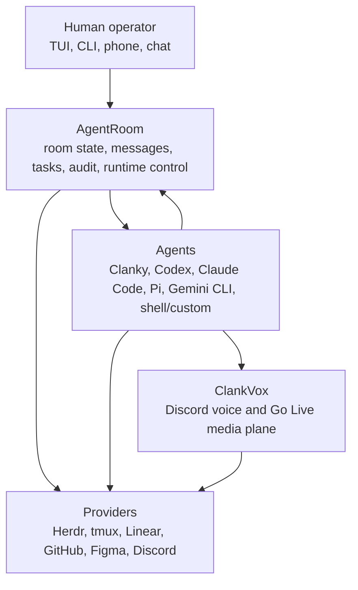
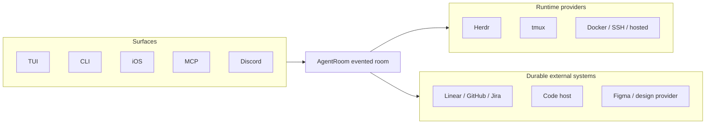
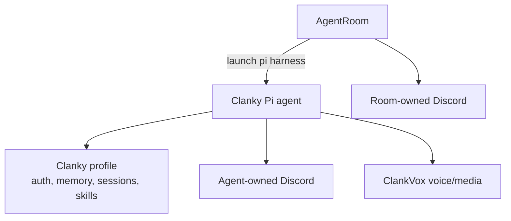

# Ecosystem Tour

These docs should answer three questions quickly:

1. What powerful things can I do as a user?
2. What work should I let my agents handle?
3. What mental model explains what is happening under the hood?

AgentRoom is the room and control plane. Clanky is the personal Pi agent that
can live inside or outside a room. ClankVox is the native media plane that makes
Discord voice and Go Live work. The iOS client makes the room reachable when
the operator is away from the desk.

## 1. What You Can Do

Use AgentRoom as an agent command center:

- open the TUI and ask the operator what is happening
- see active agents, tasks, messages, runtime output, and recent audit events
- launch workers into Herdr or tmux without leaving the room model
- send instructions and read output through audited AgentRoom commands
- link local task shadows to durable tracker issues
- expose room tools to MCP-capable agents
- route Discord or another chat surface into a room-owned conversation
- pair a phone over tailnet and check the room on the go
- run Clanky as a personal agent, a room lead, a worker, or a reviewer

> GIF slot: `docs/assets/gifs/agentroom-tui-overview.gif`  
> Capture: ask the operator "what is happening?", then move through Overview,
> Agents, Tasks, Messages, and Events.

> GIF slot: `docs/assets/gifs/mobile-room-check.gif`  
> Capture: `agent-room mobile-connect --copy`, open the pairing link on iPhone,
> and inspect a running room.

## 2. What Agents Should Handle

Let agents own the work that benefits from durable context, room awareness, and
tool access:

- claim a task shadow before editing
- inspect the current repo and post a concise plan
- launch or request helper workers when a task splits cleanly
- ask reviewers for focused checks through room DMs
- wait for messages, task status changes, or human approval without polling
  chat manually
- update the external tracker when durable work status changes
- summarize runtime output for the operator instead of dumping raw logs
- preserve terminal audit by using AgentRoom `send` and `read`
- delegate voice, Discord, web, media, or MCP-specific work to the agent with
  the right profile and skills

The agent should not treat a terminal pane, Discord channel, or tracker issue as
the whole system. Those are surfaces. The room is the coordination model.

> GIF slot: `docs/assets/gifs/agentroom-launch-provider.gif`  
> Capture: launch two workers, assign one implementation task and one review
> task, then show the room event log proving what happened.

> GIF slot: `docs/assets/gifs/clanky-tui-discord.gif`  
> Capture: Clanky continuing local TUI work while Discord routes a side request
> through a subagent and delegates durable work back to the main session.

## 3. Mental Model

The workspace has three layers:

Read it as:

- the human asks the room, not a random pane
- agents coordinate through the room, not private scratchpads
- providers are replaceable adapters
- Clanky can bring personal state, memory, Discord, voice, media, and skills
- ClankVox stays below Clanky as deterministic transport code

## Room Versus Surfaces

The surfaces are ways into the room. They are not the source of truth. The
runtime provider controls process placement. The external tracker remains
canonical for durable project work. AgentRoom keeps the active execution record.

## Clanky In The Room

Room participation and chat ownership are separate decisions. Clanky can keep
its own Discord identity while participating in AgentRoom, or the room daemon can
own a connector bot and route chat to a lead agent. One external conversation
should have one owner.

For the Clanky product tour, jump to
[Clanky Start Here](docs://clanky-docs/start-here). For the voice/media plane,
jump to [ClankVox Overview](docs://clankvox-docs/overview).

## Repo Roles

| Repo             | Role                   | What the docs should prove                                                                                                                    |
| ---------------- | ---------------------- | --------------------------------------------------------------------------------------------------------------------------------------------- |
| `agent-room`     | Coordination plane     | The TUI, daemon, MCP server, runtime adapters, mobile pairing, room events, task shadows, and provider ports form one control surface.        |
| `clanky-pi`      | Personal Pi agent      | Clanky is stateful, profile-scoped, memory-aware, Discord-capable, voice-capable, media-capable, and launchable as a normal AgentRoom worker. |
| `clankvox`       | Native media plane     | Discord voice and Go Live need deterministic transport code: RTP, Opus, DAVE, H264/VP8, playback pacing, and JSON-line IPC.                   |
| `agent-room-ios` | Mobile operator client | A room can be checked and steered over a private tailnet without exposing the daemon publicly.                                                |
| `docs`           | Shared docs shell      | Night Compiler keeps the docs sites consistent while each repo owns its content.                                                              |
| `discord_mcp`    | Discord utility MCP    | Discord-only inspection and operations stay available without turning Discord into the room source of truth.                                  |

## Where To Go Next

- [Setup Guide](SETUP.md): choose runtime, harness, tracker, messaging surface,
  skills, and operator clients.
- [Room Topology](TOPOLOGY.md): one room per project, one HQ room across repos,
  or a hybrid.
- [Coordination Model](COORDINATION.md): what belongs in AgentRoom versus the
  durable work tracker.
- [Runtime Providers](RUNTIMES.md): Herdr, tmux, fake runtime, adoption, and
  audited commands.
- [Security Model](SECURITY.md): token ownership, terminal audit, and local
  trust boundaries.
