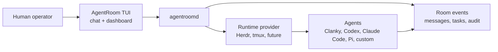

# Terminal TUI

The AgentRoom TUI is the normal front door for humans. It is a terminal
dashboard with an operator chat on the first screen. Start there, ask the room
what is happening, and let the dashboard agent use the room tools for you.

```bash
agent-room
```

If no local daemon is reachable, the TUI can start one for the session. The
plain command is the normal entry point. From a source checkout before a global
install, add this repo's `node_modules/.bin` to `PATH` or run
`pnpm agent-room`. If you are connecting to a daemon that was started
separately on a non-default URL, pass the daemon URL to `agent-room`:

```bash
agent-room --daemon http://127.0.0.1:4317
```

## What To Ask

Use plain language first:

```text
What is running in this room?
Show me the active tasks.
Launch an implementation agent in this workspace.
Read the last 80 lines from reviewer-1.
Send impl-2 a reminder to post status before editing.
Which agent is blocked?
```

The dashboard agent should translate those requests into room operations:
messages, tasks, launches, runtime reads, runtime sends, waits, and status
summaries. You do not need to know the full CLI for day-to-day operation.

## Views

Use the views when you want to inspect state directly:

| View       | Use it for                                                         |
| ---------- | ------------------------------------------------------------------ |
| Chat       | Ask the operator what is happening and request room actions.       |
| Overview   | Check daemon health, runtime provider, room id, and recent status. |
| Workspaces | See registered cwd/project contexts.                               |
| Agents     | See launched or adopted agents and their runtime bindings.         |
| Tasks      | Inspect local task shadows and active ownership.                   |
| Messages   | Read room channels, direct messages, and handoffs.                 |
| Events     | Audit room activity, runtime reads/sends, and provider changes.    |
| Help       | See hotkeys, slash commands, and environment knobs.                |

`Ctrl+G` and `Ctrl+L` cycle views. `Esc` opens the view picker. `?` opens Help.

## Setup

Run `/setup` from Chat on first start or whenever the room feels misconfigured.
It shows the active config file, runtime, work tracker, Clanky room defaults,
dashboard auth, and chat gateway status.

Useful setup commands:

```text
/setup
/setup runtime herdr
/setup tracker linear team_123
/setup clanky agent .clanky-room lead
/config
/protocol
```

Setup commands write the same `.agentroom/config.yaml` model as the CLI.
`/protocol` shows `.agentroom/AGENTS.md`, the editable room protocol used by the
dashboard agent and launched workers. Secrets stay in environment variables,
MCP/connector auth, or auth stores; the config file stores portable non-secret
defaults.

## Mental Model



The TUI is a surface. The daemon and event store hold the room state. Runtime
providers place processes in Herdr, tmux, or future execution backends. Agents
coordinate through the room rather than through private terminal assumptions.

## When To Use The CLI Instead

Use the CLI when you need a script, a repeatable smoke check, or a precise
automation step:

```bash
agent-room launch impl --harness codex --command "codex" --cwd .
agent-room read impl --lines 80
agent-room send impl "Post status, then continue."
agent-room events --follow
```

The complete command map lives in [CLI Reference](CLI_REFERENCE.md).
